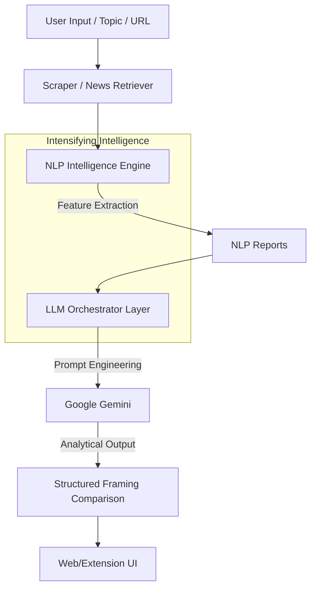

# ⚖️ Even Handed - The News Framing Engine


## 📌 Project Overview
**Even Handed** is an AI-powered news analysis platform designed to help readers understand how different news outlets frame the same real-world events. Instead of labeling articles as "biased" or "unbiased", our project focuses on the *how*—uncovering patterns in language, tone, and emphasis through advanced NLP and Large Language Models.

---

## 🚀 Key Features

- **🧠 NLP-Driven Insights**: Deep analysis of articles for sentiment, emotion, speculation, and loaded terms using `VADER`, `spaCy`, and `sentence-transformers`.
- **✨ LLM-Powered Orchestration**: Leverages **Google Gemini** to generate a neutral, analytical framing comparison of multiple news sources.
- **🌐 Chrome Extension**: Analyze what you're reading in real-time. Instantly compare the current article with top-ranked alternatives.
- **📊 Web Platform**: A comprehensive dashboard for deep topic-based searches and side-by-side news comparisons.
- **🔍 Automated Scraping**: Multi-source scraping pipeline with `newspaper3k` and fallback mechanisms for robust data ingestion.

---

## 🏗️ System Architecture

The core pipeline follows a structured data flow, ensuring analytical neutrality:



---

## 📂 Project Structure

```bash
Even Handed/
├── Website/                      # Web Platform & Core Backend
│   ├── api_gateway.py            # FastAPI Entry point
│   ├── nlp_engine.py             # NLP Analytics module
│   ├── llm_orchestrator.py       # LLM Generation layer
│   ├── client/                   # Website Frontend (HTML/JS)
│   ├── endpoints/                # API Route handlers
│   ├── models/                   # Pydantic/Data schemas
│   ├── services/                 # Core logic services (Scraping, Pipeline)
│   ├── test_nlp_engine.py        # NLP Engine test suite
│   └── test_llm_orchestrator.py  # LLM Orchestrator test suite
├── Extension/                    # Chrome Extension Components
│   ├── backend/                  # Extension-specific FastAPI server
│   ├── extension/                # Chrome extension frontend
│   ├── prompt/                   # System prompts for Analysis
│   └── requirements.txt          # Extension dependencies
└── README.md                     # Project Documentation
```

---

## ⚙️ Setup & Installation

### 1. Prerequisites
- Python 3.10+
- Google Gemini API Key

### 2. Core Backend Setup
```bash
# Navigate to website folder
cd Website

# Install dependencies
pip install -r requirement.txt
pip install google-generativeai
python -m spacy download en_core_web_sm

# Set Environment Variables
export GEMINI_API_KEY="your_api_key_here"

# Run tests
python3 test_nlp_engine.py
python3 test_llm_orchestrator.py
```

### 3. Extension Setup
```bash
# Navigate to extension folder
cd Extension

# Create virtual environment
python3 -m venv venv
source venv/bin/activate

# Install dependencies
pip install -r requirements.txt

# Run Extension Backend
uvicorn backend.main:app --reload
```

---

## 🛠️ Tech Stack

- **Backend**: FastAPI, Python
- **AI/ML**: Google Gemini (LLM), SpaCy (NLP), VADER (Sentiment), Sentence-Transformers (Similiarity)
- **Frontend**: Vanilla HTML/JS, CSS (Glassmorphism & Modern UI)
- **Scraping**: newspaper3k, BeautifulSoup, NewsAPI

---

## 🛡️ Analytical Principles
1. **Neutrality First**: We never judge or label sources.
2. **Evidence-Based**: All claims of framing variation are backed by linguistic data.
3. **Visibility**: Our goal is to make the "framing" of news visible to the end user.

---


